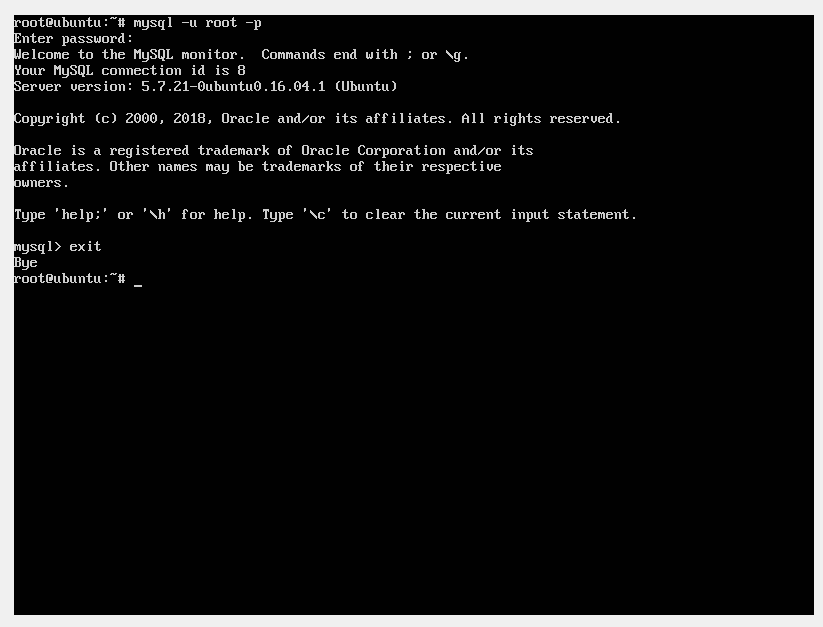

# Tutorial Install LAMP Stack di Ubuntu Server 16.04

LAMP sendiri adalah singkatan dari *Linux, Apache, MySQL, dan PHP*, dimana LAMP adalah kumpulan aplikasi yang digunakan untuk menghosting aplikasi web di Linux.

Sebenarnya Ubuntu sendiri sudah menyediakan cara pintas untuk meng-install LAMP dan aplikasi server lainnya *-mungkin nanti akan saya bahas tutorialnya di-post lain-*, tetapi di tutorial ini,saya akan menjelaskan *step by step* instalasi LAMP agar kita semua mengerti cara kerja web server itu sendiri.

Jika anda meng-install LAMP di Ubuntu Server yang ada di Virtual Box, pastikan dulu Virtual Machine anda terhubung ke internet.
```
$ ping google.com
```
selanjutnya baru lanjut ke tahap instalasi aplikasi.
## 1. Install Apache dan Konfigurasi Firewall
Apache adalah aplikasi open source dibawah lisensi *Apache License 2* yang bertanggung jawab untuk request & respond dari Protokol HTTP serta melakukan logging informasi secara mendetail. lengkapnya bisa baca di [Wikipedia](https://en.wikipedia.org/wiki/Apache_HTTP_Server).

```bash
$ sudo apt-get update && apt-get upgrade  
$ sudo apt-get -y install apache2 
```

### Konfigurasi Firewall 
konfigurasi firewall ini dimaksudkan untuk memperbolehkan web traffic dari protokol HTTP & HTTPS.

Sekarang kita lihat aplikasi yang ada di Firewall.
**Input**
```bash
$ sudo ufw app list 
```
**Output**
```bash
Available applications:
  Apache
  Apache Full
  Apache Secure
  OpenSSH
```
Selanjutnya, kita melihat dari deskripsi dari __*Apache Full*__ .
**Input**
```bash
$ sudo ufw app info "Apache Full"
```
**Output**
```bash
Available applications:
  Apache
  Apache Full
  Apache Secure
  OpenSSH
```
Ketik command line dibawah ini untuk memperbolehkan akses keluar dan masuknya traffic web di  __*Apache Full*__ .

**Input**
```bash
$ sudo ufw allow in "Apache Full"
```
**Output**
```bash
Rule updated
Rule updated (v6)
```

### Mengakses Apache2
Jika Apache2 sudah terinstall dan firewall sudah terkonfigurasi, kini kita akan menge-test apakah Apache2 berjalan dengan baik.
pertama silakan untuk menge-check IP Address Server,
**Input**
```bash
$ ifconfig enp0s3 | grep "inet addr"
```
Note: 
 **enp0s3** adalah nama ethernet dari system,silakan ifconfig secara manual untuk melihat nama ethernet anda,jika terjadi error atau *inet addr* tidak muncul

**Ex. Output**
```bash
inet addr:192.168.100.47 Bcast:192.168.100.255 Mask:255.255.255.0
```
Jika anda meng-install Ubuntu Server di VirtualBox, maka kita bisa mengakses situs Apache2 kita melalui Host OS kita dengan mengetikkan :

```bash
http://Nomor_IP_Server_Anda
contoh -> http://192.168.100.47
```

Atau jika anda menginstall Ubuntu Server anda di VPS / Server yang anda sewa di internet,anda bisa mengaksesnya dengan menggunakan IP Public anda seperti contoh diatas.

Dan jika tampilan di browser anda muncul web seperti dibawah ini, maka artinya Apache anda telah berhasil di install dengan baik.


## 2. Install MySQL 
MySQL adalah Aplikasi Database bersifat Open source yang banyak digunakan di dalam aplikasi web.

### Install 
```bash
$ sudo apt-get update
$ sudo apt-get install mysql-server
```
Setelah itu akan muncul konfigurasi MySQL

#### MySQL Password untuk Root User
Silakan masukkan password untuk user **root** dan di tampilan selanjutnya akan diminta untuk memasukkan ulang password.


masukkan ulang password


### Akses MySQL
```bash
$ sudo mysql -u root -p
```
Setelah anda memasukkan password MySQL yang telah anda atur saat meng-install MySQL, maka tampilan-nya akan muncul seperti dibawah ini:


Untuk LogOut dari MySQL silakan mengetik command line **exit** :
```bash
mysql > exit
```

## 3. Install PHP 7.0 & PHP 7.0 Modules
```bash
$ sudo apt-get install php7.0 php7.0-*
```
### Testing Installed PHP 7.0
**Check PHP Version :**
```bash
$ php -v
```
### Fixing Error
jika muncul error seperti dibawah ini setelah mencoba check versi dari PHP
```
Cannot adopt OID in UCD-SNMP-MIB: ssIOReceive ::= { systemStats 6 }
Cannot adopt OID in UCD-SNMP-MIB: ssIOSent ::= { systemStats 5 }
Cannot adopt OID in UCD-SNMP-MIB: ssSwapOut ::= { systemStats 4 }
Cannot adopt OID in UCD-SNMP-MIB: ssSwapIn ::= { systemStats 3 }
Cannot adopt OID in UCD-SNMP-MIB: ssErrorName ::= { systemStats 2 }
Cannot adopt OID in UCD-SNMP-MIB: ssIndex ::= { systemStats 1 }
Cannot adopt OID in NET-SNMP-EXTEND-MIB: nsExtendOutput2Entry ::= { nsExtendOutput2Table 1 }
Cannot adopt OID in UCD-SNMP-MIB: laEntry ::= { laTable 1 }
```
tinggal jalankan command dibawah ini:
```bash
$ sudo apt-get remove php7.0-snmp
```
dan jika sudah di __remove__, ketika kita menge-check versi PHP lagi, maka akan muncul seperti ini.


Letak folder untuk menyimpan file untuk menghosting website PHP ada disini:
```bash
/var/www/html/
```
## SELESAI


