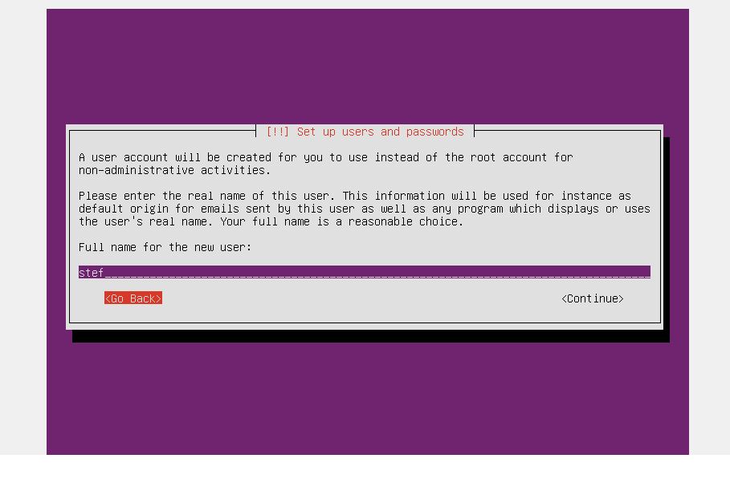
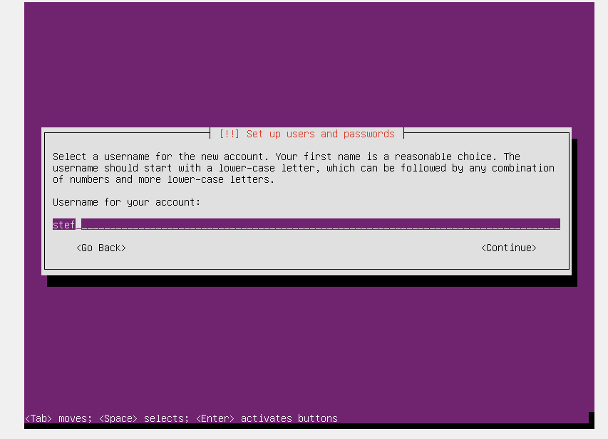
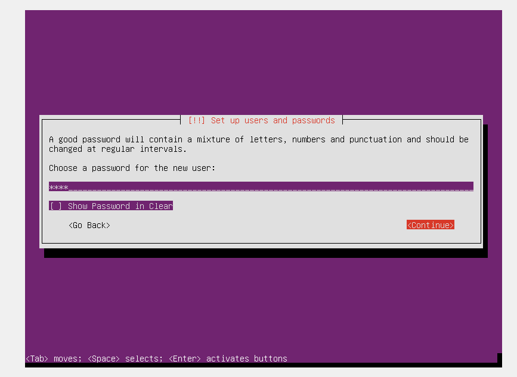
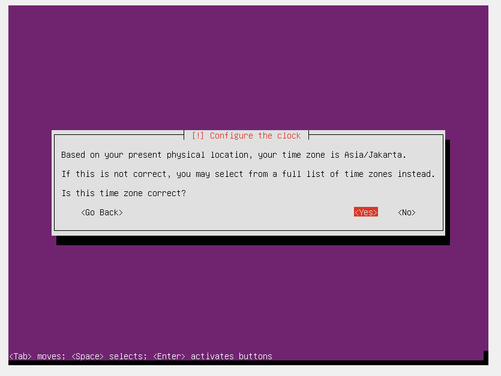
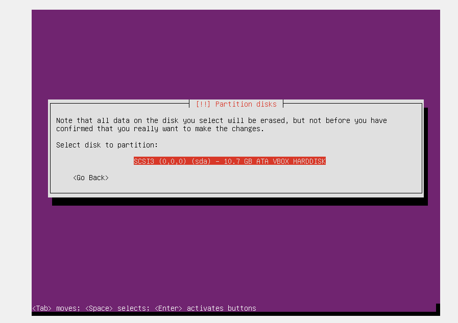
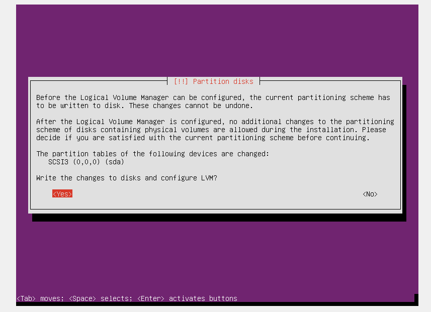
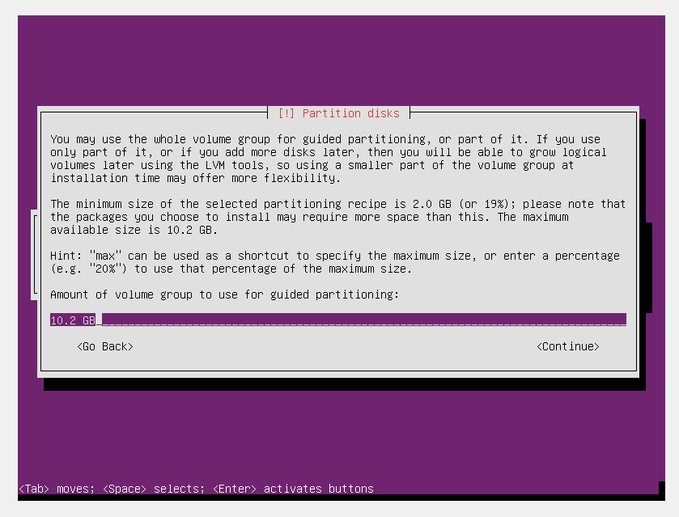
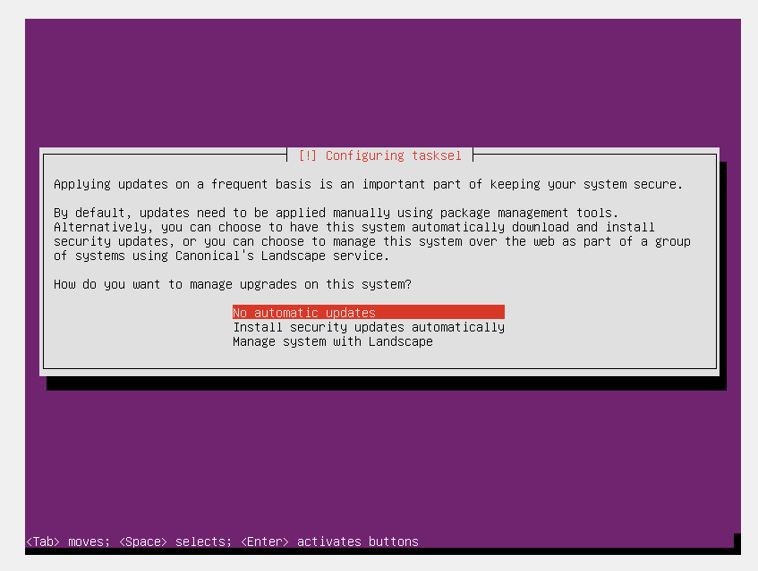
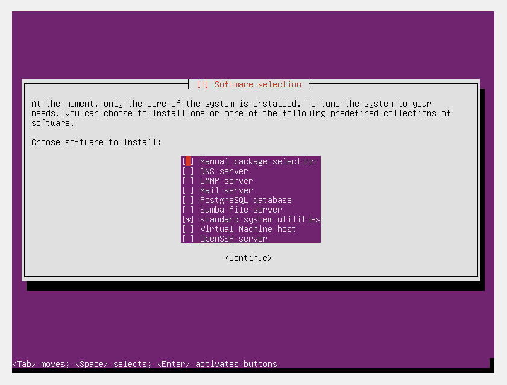
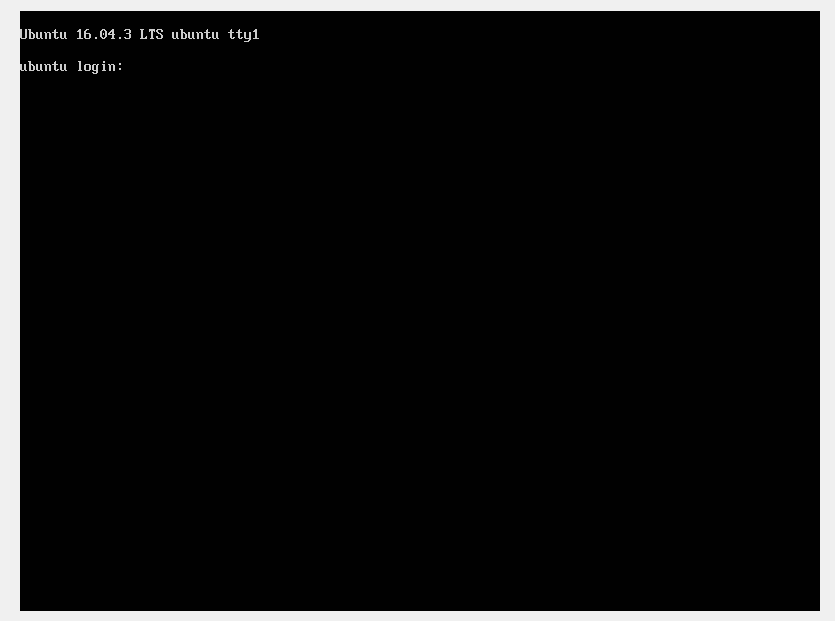

# Installing Ubuntu Server 16.04 di Virtual Box

Di tutorial ini saya menganggap kalian sudah bisa membuat VM baru di VirtualBox, dan akan langsung saja jelaskan tahap penginstalan saja.

untuk File Requeirment & Spesifikasi server minimal :
- ISO Ubuntu server 16.04 -> [Download (direct link)](http://releases.ubuntu.com/16.04.3/ubuntu-16.04.3-server-amd64.iso)
- RAM 512MB
- Disk 10GB 

### 1. Pemilihan Bahasa
Pilih Opsi **English**, tinggal klik tombol __Enter__ saja

### 2. Install Ubuntu Server
Pilih Opsi pertama -> **Install Ubuntu Server**

### 3. Pilih Bahasa untuk Penginstall-an OS
Langsung aja pilih bahasa **English** dan __Enter__ untuk next step.

### 4. Pemilihan Lokasi Server
Pilih lokasi sesuai server yang di sewa,karena ini akan berdampak pada **timezone** server. Disini saya memilih Lokasi Singapore dan akan langsung beralih ke __Konfigurasi Keyboard__ .

### 5. Deteksi Type Keyboard
Kita tidak perlu mengetes/mendeteksi keyboard yg kita gunakan,Pilih saja Opsi **NO** karena secara default keyboard kita menggunakan Keyboard __English US__, dan pilihan Opsi __English US__ akan bisa dipilih di step selanjutnya.

### 6. Konfigurasi Keyboard & Keyboard Layout
Pilih saja opsi __English (US)__ dan di Keyboard Layout juga pilih Opsi __English (US)__

### 7. Hostname / Nama Server
Ditunggu saja, akan ada proses Detection Hardware, Detection Component, Network,dll
Dan setelah secara otomatis berjalan,akan sampai di penulisan Hostname, Hostname bisa ditulis sesuai nama yang anda mau atau bisa diisikan secara default bernama __Ubuntu__ dan pilih Continue.

### 8. Set up User baru

##### Nama Lengkap User baru
Ketik saja nama user sesuai keinginan anda.

##### Username User baru
Disini saya menggunakan username yang sama dengan full name,username disini digunakan untuk nanti kita login.

##### Set Password 
Silakan isikan password untuk user anda,diharapkan untuk menggunakan password yang kuat, dan jika password anda lemah,akan ada opsi lanjut untuk memastikan apakah anda mau menggunakan password tersebut atau mau menggantinya dengan password baru.
DIsini juga ada Opsi __[ ]Show Password__, silakan menggunakan tombol __TAB__ untuk mengarahkan ke kotak bracket siku dan klik tombol __SPACE__ untuk mencentang Opsi __[ ]Show Password__ .

Dan silakan memasukkan password lagi untuk memastikan password anda.

##### Weak Password
karena password yang saya masukkan kurang kuat,maka akan ditanyakan apakah mau menggunakan password tersebut, klik __YES__ jika untuk menggunakan password lemah yang kita ketikkan tadi, klik __NO__ untuk mengganti password yang lebih kuat.

### 9. Enkripsi Direktori Home
Enkripsi direktori Home agar menjaga keamanan partisi/direktori Home menggunakan password lagi untuk masuk ke direktori tersebut.
Disini saya tidak meng-enkripsi direktori Home dan memilih Opsi __NO__, dikarenakan Server ini hanya untuk bahan belajar saja.

### 10. Konfigurasi Jam
Pada Proses ini, system akan mendeteksi secara otomatis berdasarkan lokasi fisik komputer/laptop kita. Pilih saja __YES__ jika sudah sesuai dengan Zona Waktu kita.

### 11. Mem-partisi Disk
Disini akan diberikan 4 Opsi,yaitu:
- __Guided - Use entire Disk__
Opsi ini akan secara otomatis membuat partisi diDisk tanpa kita membagi partisi secara manual
- __Guided - Use entire disk and set up LVM__
sama seperti opsi *Guided - Use entire disk*, tetapi disini kita akan menggunakan LVM, apa itu LVM silakan baca di [Wikipedia](https://en.wikipedia.org/wiki/Logical_Volume_Manager_(Linux))
- __Guided - use entire disk and set up encrypted LVM__
Sama seperti Opsi 2,tetapi disini partisi kita akan ter-enkripsi
- __Manual__
Di Opsi ini kita akan membuat partisi secara manual, dan mengalokasikan partisi Home,Swap,Boot,Root(/) secara manual.

Dan kali ini saya akan menggunakan Opsi __Guided - Use entire disk and set up LVM__

### Formatting Disk
##### Select Disk
Klik saja pada disk yang akan digunakan dan selanjutnya disk akan diformat untuk di buatkan partisi secara otomatis. pada kali ini disk hanya 1 karena VirtualDisk yang kita buat hanya 1.

##### Write Changes
pilih saja __YES__ untuk mengubah partisi secara otomatis

#### Ukuran Disk
Secara default Ukuran Disk yang tertulis adalah ukuran maksimal disk yang ada,
silakan baca lampiran text yang ada untuk pengubahan ukuran disk.
Disini saya menggunakan ukuran maksimal dari disk yang ada, yaitu 10.2GB

##### Formatting Disk
Pilih saja Opsi __YES__ untuk mengubah disk menjadi partisi yang sudah dibuat oleh system.

*setelah itu system akan berjalan dengan otomatis untuk mem-format disk,mengubah disk ke dalam partisi dan akan dilakukan instalasi system ke dalam partisi yang sudah dibuat.*

### 12. HTTP Proxy Information
kita belum perlu menggunakan HTTP Proxy,siakan __Continue__ saja

*ditunggu saja pada saat __Configuring APT__ dan instalasi lain sampai selesai*

### 13. System Updates
Di Opsi ini saya memilih Opsi __No Automatic Update__,karena server ini hanya digunakan untuk belajar saja,tetapi jika kita akan menginstallnya di server online,silakan mempertimbangkan opsi yang lain untuk keamanan dan konfigurasi server yang anda mau.

### 14. Software Selection
Opsi ini sangat memudahkan kita untuk langsung bisa memilih aplikasi server apa yang mau dipakai dan kita hanya perlu mengkonnfigurasi saja ketika server telah terinstall, tetapi pada kali ini saya hanya memilih __Standard System Utilities__, dikarenakan akan dipakai sebagai bahan belajar untuk menginstall dan mengkonfigurasi aplikasi server secara manual.

### 15. Install Grub Boot Loader
Setelah proses __Software Selection__, kita akan sampai pada tahap *Install Grub Boot Loader*, pilih saja __YES__ untuk menginstall Grub Boot Loader di Master Boot Record.

### 16. Finishing the Installation
Setelah Proses Install Grub Boot Loader telah selesai, dan memilih opsi __Continue__, kita perlu memastikan ISO yang kita masukkan pada saat penginstalan OS telah di-*eject*.

dan setelah itu System akan ter-restart sendiri dan kita bisa login menggunakan username dan password yang telah kita buat tadi..

